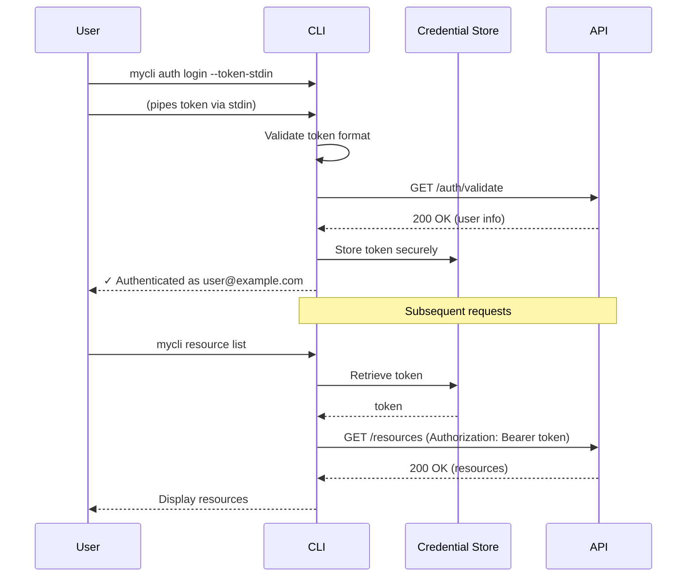
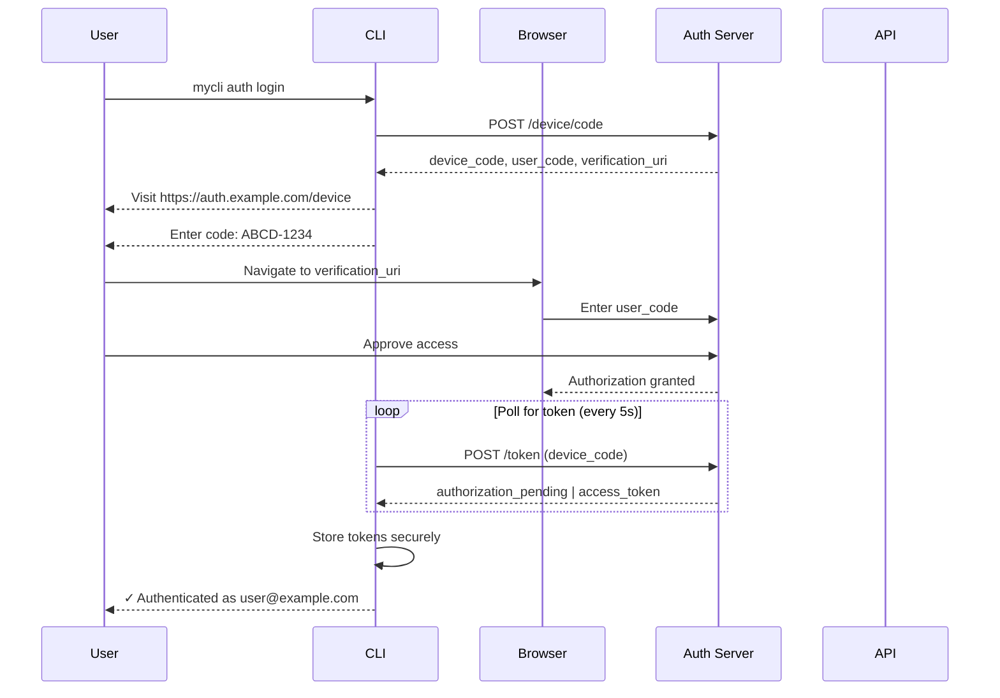
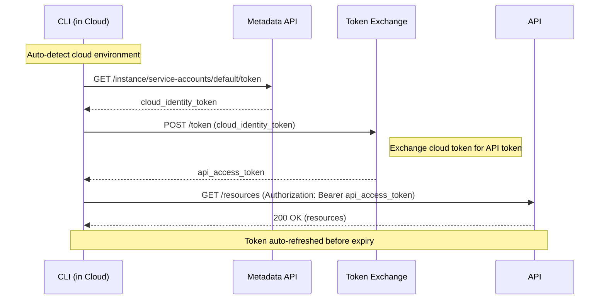
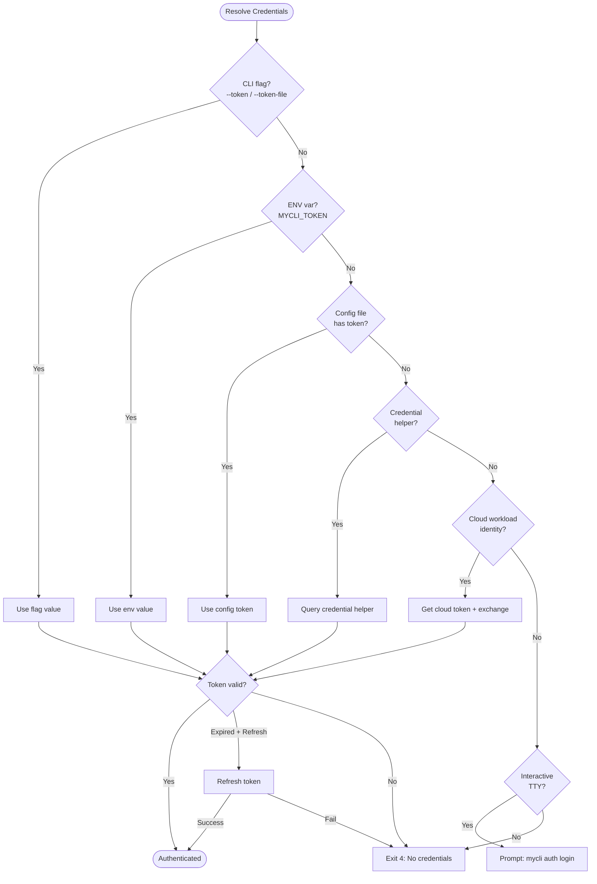

# Discovery and Authentication

Reference patterns for CLI discoverability, help systems, authentication, and configuration management.

---

## Table of Contents

- [Standard Flag Reference](#standard-flag-reference)
- [Exit Codes](#exit-codes)
- [Configuration Precedence](#configuration-precedence)
- [Authentication Flow Diagrams](#authentication-flow-diagrams)
- [1. Command Grammar](#1-command-grammar)
- [2. Self-Documenting Help](#2-self-documenting-help)
- [3. Version and Capabilities](#3-version-and-capabilities)
- [4. Authentication Patterns](#4-authentication-patterns)
- [5. Configuration Management](#5-configuration-management)
- [6. Multi-Provider Support](#6-multi-provider-support)
- [7. Secret Handling Rules](#7-secret-handling-rules)
- [8. Environment Detection](#8-environment-detection)
- [Quick Reference](#quick-reference)

This file owns help, flags, auth, config, and environment discovery. Use `output-contracts.md` as the canonical source for detailed JSON envelopes and exit-code taxonomy.

## Standard Flag Reference

All well-designed CLIs should support these standard flags consistently:

| Flag | Short | Type | Purpose | Example |
|------|-------|------|---------|---------|
| `--json` | `-j` | bool | Structured JSON output for machine parsing | `mycli list --json` |
| `--quiet` | `-q` | bool | Suppress non-essential output (warnings, info) | `mycli deploy -q` |
| `--verbose` | `-v` | bool | Increase verbosity (debug info, timing) | `mycli run -v` |
| `--yes` | `-y` | bool | Skip all confirmations / auto-approve | `mycli delete all -y` |
| `--dry-run` | | bool | Preview changes without executing | `mycli apply --dry-run` |
| `--force` | `-f` | bool | Override safety checks and guards | `mycli rm protected -f` |
| `--output` | `-o` | string | Output format: `json`, `yaml`, `table`, `text` | `mycli get -o yaml` |
| `--timeout` | | duration | Operation timeout (e.g., `30s`, `5m`) | `mycli sync --timeout 2m` |
| `--no-input` | | bool | Non-interactive mode; fail if input needed | `mycli setup --no-input` |
| `--help` | `-h` | bool | Show help for command | `mycli deploy -h` |

### Flag Behavior Matrix

| Environment | `--json` | `--quiet` | `--verbose` | Colors | Prompts |
|-------------|----------|-----------|-------------|--------|---------|
| TTY (human) | Off | Off | Off | On | On |
| CI | Auto-on | Auto-on | Off | Off | Off |
| Piped | Auto-on | Auto-on | Off | Off | Off |
| `--no-input` | Unchanged | Unchanged | Unchanged | Unchanged | Off |

### Implementation Pattern

```go
// Add standard flags to root command
func addStandardFlags(cmd *cobra.Command) {
    cmd.PersistentFlags().BoolP("json", "j", false, "Output as JSON")
    cmd.PersistentFlags().BoolP("quiet", "q", false, "Suppress non-essential output")
    cmd.PersistentFlags().BoolP("verbose", "v", false, "Increase verbosity")
    cmd.PersistentFlags().BoolP("yes", "y", false, "Skip confirmations")
    cmd.PersistentFlags().Bool("dry-run", false, "Preview without executing")
    cmd.PersistentFlags().BoolP("force", "f", false, "Override safety checks")
    cmd.PersistentFlags().StringP("output", "o", "table", "Output format: json|yaml|table|text")
    cmd.PersistentFlags().Duration("timeout", 30*time.Second, "Operation timeout")
    cmd.PersistentFlags().Bool("no-input", false, "Non-interactive mode")
}
```

---

## Exit Codes

Standardized exit codes for consistent error handling in scripts and CI:

| Code | Name | Description | Example Scenario |
|------|------|-------------|------------------|
| `0` | Success | Operation completed successfully | `mycli deploy` → deployed |
| `1` | Crash | Unexpected error / panic / internal failure | Nil pointer, unhandled exception |
| `2` | Usage | Invalid arguments, missing required flags, bad syntax | `mycli --invalid-flag` |
| `3` | NotFound | Requested resource does not exist | `mycli get user xyz` → no such user |
| `4` | Auth | Authentication or authorization failure | Expired token, insufficient permissions |
| `5` | Conflict | Resource conflict, already exists, version mismatch | `mycli create foo` → already exists |
| `6` | Validation | Input validation failed (bad format, out of range) | `mycli set --port 999999` |
| `7` | Transient | Temporary failure, retry may succeed | Network timeout, rate limit, 503 |

### Implementation Pattern

```go
const (
    ExitSuccess    = 0
    ExitCrash      = 1
    ExitUsage      = 2
    ExitNotFound   = 3
    ExitAuth       = 4
    ExitConflict   = 5
    ExitValidation = 6
    ExitTransient  = 7
)

func exitWithError(err error) {
    var code int
    switch {
    case errors.Is(err, ErrNotFound):
        code = ExitNotFound
    case errors.Is(err, ErrUnauthorized), errors.Is(err, ErrForbidden):
        code = ExitAuth
    case errors.Is(err, ErrConflict), errors.Is(err, ErrAlreadyExists):
        code = ExitConflict
    case errors.Is(err, ErrValidation), errors.Is(err, ErrInvalidInput):
        code = ExitValidation
    case errors.Is(err, ErrTimeout), errors.Is(err, ErrRateLimit), errors.Is(err, ErrUnavailable):
        code = ExitTransient
    case errors.Is(err, ErrUsage):
        code = ExitUsage
    default:
        code = ExitCrash
    }
    fmt.Fprintln(os.Stderr, err)
    os.Exit(code)
}
```

### Scripting with Exit Codes

```bash
#!/bin/bash
mycli deploy my-app --env prod
case $? in
    0) echo "Deploy succeeded" ;;
    4) echo "Auth failed - re-authenticate"; mycli auth login ;;
    7) echo "Transient error - retrying..."; sleep 5; mycli deploy my-app --env prod ;;
    *) echo "Fatal error"; exit 1 ;;
esac
```

---

## Configuration Precedence

Configuration values are resolved in this order (highest to lowest priority):

```
┌─────────────────────────────────────────────────────────────┐
│  1. CLI Flags          (highest priority)                   │
│     mycli --api-url https://custom.api.com deploy           │
├─────────────────────────────────────────────────────────────┤
│  2. Environment Variables                                   │
│     MYCLI_API_URL=https://env.api.com mycli deploy          │
├─────────────────────────────────────────────────────────────┤
│  3. Project Config     (.mycli.yaml in cwd or parents)      │
│     api_url: https://project.api.com                        │
├─────────────────────────────────────────────────────────────┤
│  4. User Config        (~/.config/mycli/config.yaml)        │
│     api_url: https://user.api.com                           │
├─────────────────────────────────────────────────────────────┤
│  5. System Config      (/etc/mycli/config.yaml)             │
│     api_url: https://system.api.com                         │
├─────────────────────────────────────────────────────────────┤
│  6. Defaults           (built into binary)                  │
│     api_url: https://api.example.com                        │
└─────────────────────────────────────────────────────────────┘
```

### Debug Config Sources

```bash
mycli config show --effective --json
```

```json
{
  "api_url": {
    "value": "https://custom.api.com",
    "source": "flag",
    "sources_checked": ["flag", "env", "project", "user", "system", "default"]
  },
  "timeout": {
    "value": "30s",
    "source": "user_config",
    "file": "~/.config/mycli/config.yaml"
  }
}
```

---

## Authentication Flow Diagrams

### Token-Based Authentication



### OAuth 2.0 Device Flow (Headless/CI)



### Service Account / Workload Identity



### Credential Resolution Flow



---

## 1. Command Grammar

### Noun-Verb Hierarchy (Preferred)

```
mycli <noun> <verb> [args] [flags]

mycli user create --name alice
mycli user list --json
mycli user delete alice

mycli deployment apply -f deploy.yaml
mycli deployment status my-app
```

**Benefits:**
- Hierarchical discovery (`mycli --help` → `mycli user --help`)
- Groups related actions
- Predictable exploration

### Consistent Flag Naming

See **Standard Flag Reference** at the top for the complete flag table. Key principles:

- **Short flags**: Reserve single letters for frequently-used flags (`-j`, `-q`, `-v`, `-y`, `-f`, `-o`, `-h`)
- **Boolean defaults**: All boolean flags default to `false`
- **Negation**: Support `--no-<flag>` for disabling defaults (e.g., `--no-wait`)
- **Profile support**: Use `--profile` / `-p` for selecting config profiles

---

## 2. Self-Documenting Help

### Help Should Answer 5 Questions

1. What does this command do?
2. What arguments are required?
3. What flags are available?
4. What output formats exist?
5. What are realistic examples?

### Good Help Example

```
Deploy a service to the target environment.

Usage:
  mycli deploy <service-name> --env <environment> [flags]

Arguments:
  service-name    Name of the service to deploy (required)

Flags:
      --env string        Target environment: dev, staging, prod (required)
      --image string      Container image override (default: from config)
      --replicas int      Number of replicas (default: from config)
      --dry-run           Preview changes without applying
      --wait              Wait for deployment to complete (default: true)
      --timeout duration  Maximum wait time (default: 5m)
      --json              Output result as JSON

Examples:
  # Deploy to staging
  mycli deploy web-api --env staging

  # Deploy specific image to production
  mycli deploy web-api --env prod --image myregistry/web:v2.1.0 --json

  # Preview deployment changes
  mycli deploy web-api --env dev --dry-run
```

### Machine-Readable Help (Emerging Pattern)

```bash
mycli help --json
```

Returns structured command tree with parameter schemas.

### Implementation Example (Go/Cobra)

```go
var deployCmd = &cobra.Command{
    Use:   "deploy <service-name>",
    Short: "Deploy a service to the target environment",
    Long: `Deploy a service to the target environment.

Supports dry-run mode for previewing changes and JSON output
for integration with automation tools.`,
    Args: cobra.ExactArgs(1),
    Example: `  # Deploy to staging
  mycli deploy web-api --env staging

  # Deploy specific image to production
  mycli deploy web-api --env prod --image myregistry/web:v2.1.0 --json

  # Preview deployment changes
  mycli deploy web-api --env dev --dry-run`,
    RunE: runDeploy,
}

func init() {
    deployCmd.Flags().StringP("env", "e", "", "Target environment: dev, staging, prod (required)")
    deployCmd.Flags().String("image", "", "Container image override")
    deployCmd.Flags().Int("replicas", 0, "Number of replicas")
    deployCmd.Flags().Bool("dry-run", false, "Preview changes without applying")
    deployCmd.Flags().Bool("wait", true, "Wait for deployment to complete")
    deployCmd.Flags().Duration("timeout", 5*time.Minute, "Maximum wait time")
    deployCmd.Flags().Bool("json", false, "Output result as JSON")
    
    deployCmd.MarkFlagRequired("env")
}
```

---

## 3. Version and Capabilities

```bash
mycli version --json
```

```json
{
  "version": "2.1.0",
  "git_commit": "abc123",
  "build_date": "2024-01-15",
  "go_version": "1.21",
  "capabilities": ["streaming", "batch", "dry-run-server"],
  "api_version": "v2"
}
```

### Implementation Example

```go
type VersionInfo struct {
    Version      string   `json:"version"`
    GitCommit    string   `json:"git_commit"`
    BuildDate    string   `json:"build_date"`
    GoVersion    string   `json:"go_version"`
    Capabilities []string `json:"capabilities"`
    APIVersion   string   `json:"api_version"`
}

var versionCmd = &cobra.Command{
    Use:   "version",
    Short: "Print version and build information",
    RunE: func(cmd *cobra.Command, args []string) error {
        info := VersionInfo{
            Version:      Version,
            GitCommit:    GitCommit,
            BuildDate:    BuildDate,
            GoVersion:    runtime.Version(),
            Capabilities: []string{"streaming", "batch", "dry-run-server"},
            APIVersion:   "v2",
        }
        
        if jsonOutput, _ := cmd.Flags().GetBool("json"); jsonOutput {
            return json.NewEncoder(os.Stdout).Encode(info)
        }
        
        fmt.Printf("mycli %s (commit: %s, built: %s)\n", 
            info.Version, info.GitCommit, info.BuildDate)
        return nil
    },
}
```

---

## 4. Authentication Patterns

### Credential Resolution Order

1. CLI flags (`--token`, `--token-file`, `--token-stdin`)
2. Environment variables (`MYCLI_TOKEN`)
3. Config file / profile
4. Keychain / credential helper
5. OIDC / workload identity
6. Interactive login (human bootstrap only)

### Secure Credential Handling

```bash
# GOOD: stdin (no process list exposure)
echo "$TOKEN" | mycli auth login --token-stdin

# GOOD: file (no process list exposure)
mycli auth login --token-file /path/to/token

# ACCEPTABLE: env var
MYCLI_TOKEN=xxx mycli deploy

# BAD: command line argument (visible in ps)
mycli auth login --token secret123  # AVOID
```

### Auth Status

```bash
mycli auth status --json
```

```json
{
  "authenticated": true,
  "method": "oauth",
  "user": "alice@example.com",
  "expires_at": "2024-01-16T10:00:00Z",
  "scopes": ["read", "write"],
  "source": "config_file"
}
```

### Implementation Example

```go
type AuthStatus struct {
    Authenticated bool      `json:"authenticated"`
    Method        string    `json:"method,omitempty"`
    User          string    `json:"user,omitempty"`
    ExpiresAt     time.Time `json:"expires_at,omitempty"`
    Scopes        []string  `json:"scopes,omitempty"`
    Source        string    `json:"source,omitempty"`
}

func resolveCredentials(cmd *cobra.Command) (string, string, error) {
    // 1. Check CLI flags
    if token, _ := cmd.Flags().GetString("token"); token != "" {
        return token, "flag", nil
    }
    
    if tokenFile, _ := cmd.Flags().GetString("token-file"); tokenFile != "" {
        data, err := os.ReadFile(tokenFile)
        if err != nil {
            return "", "", fmt.Errorf("reading token file: %w", err)
        }
        return strings.TrimSpace(string(data)), "token_file", nil
    }
    
    if tokenStdin, _ := cmd.Flags().GetBool("token-stdin"); tokenStdin {
        data, err := io.ReadAll(os.Stdin)
        if err != nil {
            return "", "", fmt.Errorf("reading token from stdin: %w", err)
        }
        return strings.TrimSpace(string(data)), "stdin", nil
    }
    
    // 2. Check environment variable
    if token := os.Getenv("MYCLI_TOKEN"); token != "" {
        return token, "environment_variable", nil
    }
    
    // 3. Check config file
    cfg, err := loadConfig()
    if err == nil && cfg.Token != "" {
        return cfg.Token, "config_file", nil
    }
    
    // 4. Try credential helper
    if token, err := getFromCredentialHelper(); err == nil {
        return token, "credential_helper", nil
    }
    
    // 5. Try OIDC / workload identity
    if token, err := getWorkloadIdentityToken(); err == nil {
        return token, "workload_identity", nil
    }
    
    return "", "", fmt.Errorf("no credentials found")
}
```

### Token Refresh

Handle token refresh transparently. If token is expired but refreshable, refresh it before the operation.

```go
func getAuthenticatedClient(ctx context.Context) (*Client, error) {
    token, source, err := resolveCredentials()
    if err != nil {
        return nil, err
    }
    
    // Check if token is expired and refreshable
    if isExpired(token) {
        refreshToken, err := getRefreshToken(source)
        if err != nil {
            return nil, fmt.Errorf("token expired and no refresh token: %w", err)
        }
        
        newToken, err := refreshAccessToken(ctx, refreshToken)
        if err != nil {
            return nil, fmt.Errorf("token refresh failed: %w", err)
        }
        
        // Store new token
        if err := storeToken(source, newToken); err != nil {
            // Log but don't fail - token works for this request
            log.Printf("warning: failed to store refreshed token: %v", err)
        }
        
        token = newToken
    }
    
    return NewClient(token), nil
}
```

---

## 5. Configuration Management

> **Precedence**: See **Configuration Precedence** section above for the full resolution order.

### Profile Support

```bash
mycli --profile production deploy
# Uses [profiles.production] from config
```

### Config File Example

```yaml
# ~/.config/mycli/config.yaml
api_url: https://api.example.com
timeout: 30s
output_format: json

profiles:
  production:
    api_url: https://api.prod.example.com
    timeout: 60s
  staging:
    api_url: https://api.staging.example.com
```

### Show Effective Config

```bash
mycli config show --effective --json
```

```json
{
  "api_url": "https://api.example.com",
  "api_url_source": "environment_variable",
  "timeout": "30s",
  "timeout_source": "config_file",
  "profile": "production",
  "profile_source": "flag"
}
```

### Implementation Example

```go
type ConfigValue struct {
    Value  interface{} `json:"value"`
    Source string      `json:"source"`
}

type EffectiveConfig struct {
    APIUrl  ConfigValue `json:"api_url"`
    Timeout ConfigValue `json:"timeout"`
    Profile ConfigValue `json:"profile"`
}

func loadEffectiveConfig(cmd *cobra.Command) (*EffectiveConfig, error) {
    cfg := &EffectiveConfig{}
    
    // API URL resolution
    if url, _ := cmd.Flags().GetString("api-url"); url != "" {
        cfg.APIUrl = ConfigValue{Value: url, Source: "flag"}
    } else if url := os.Getenv("MYCLI_API_URL"); url != "" {
        cfg.APIUrl = ConfigValue{Value: url, Source: "environment_variable"}
    } else if fileCfg, _ := loadConfigFile(); fileCfg.APIUrl != "" {
        cfg.APIUrl = ConfigValue{Value: fileCfg.APIUrl, Source: "config_file"}
    } else {
        cfg.APIUrl = ConfigValue{Value: "https://api.example.com", Source: "default"}
    }
    
    // Similar pattern for other config values...
    
    return cfg, nil
}

func showEffectiveConfig(cmd *cobra.Command, cfg *EffectiveConfig) error {
    if jsonOutput, _ := cmd.Flags().GetBool("json"); jsonOutput {
        enc := json.NewEncoder(os.Stdout)
        enc.SetIndent("", "  ")
        return enc.Encode(cfg)
    }
    
    fmt.Printf("api_url: %v (from %s)\n", cfg.APIUrl.Value, cfg.APIUrl.Source)
    fmt.Printf("timeout: %v (from %s)\n", cfg.Timeout.Value, cfg.Timeout.Source)
    return nil
}
```

---

## 6. Multi-Provider Support

### Provider Selection

```bash
mycli --provider aws deploy
mycli --provider gcp deploy

# Or via config
```

```yaml
providers:
  default: aws
  aws:
    region: us-east-1
  gcp:
    project: my-project
```

### Normalized Resource Schema

```json
{
  "id": "res_123",
  "name": "my-resource",
  "provider": "aws",
  "region": "us-east-1",
  "status": "active",
  "provider_data": {
    "aws": {
      "arn": "arn:aws:..."
    }
  }
}
```

### Implementation Example

```go
type Resource struct {
    ID           string                 `json:"id"`
    Name         string                 `json:"name"`
    Provider     string                 `json:"provider"`
    Region       string                 `json:"region"`
    Status       string                 `json:"status"`
    ProviderData map[string]interface{} `json:"provider_data,omitempty"`
}

type Provider interface {
    Name() string
    ListResources(ctx context.Context, opts ListOptions) ([]Resource, error)
    GetResource(ctx context.Context, id string) (*Resource, error)
    CreateResource(ctx context.Context, spec ResourceSpec) (*Resource, error)
}

func getProvider(name string) (Provider, error) {
    switch name {
    case "aws":
        return NewAWSProvider()
    case "gcp":
        return NewGCPProvider()
    case "azure":
        return NewAzureProvider()
    default:
        return nil, fmt.Errorf("unknown provider: %s", name)
    }
}

// Normalize provider-specific data into common schema
func (p *AWSProvider) normalizeResource(awsResource *ec2.Instance) Resource {
    return Resource{
        ID:       *awsResource.InstanceId,
        Name:     getTag(awsResource.Tags, "Name"),
        Provider: "aws",
        Region:   p.region,
        Status:   normalizeStatus(*awsResource.State.Name),
        ProviderData: map[string]interface{}{
            "aws": map[string]interface{}{
                "arn":           buildARN(awsResource),
                "instance_type": *awsResource.InstanceType,
                "vpc_id":        *awsResource.VpcId,
            },
        },
    }
}
```

---

## 7. Secret Handling Rules

### Never

- Accept secrets as command-line arguments
- Print secrets to stdout or stderr
- Store secrets in plaintext config files
- Log secrets at any level

### Always

- Use stdin or file for secret input
- Redact secrets in logs (`***REDACTED***`)
- Support credential helpers (git-credential style)
- Document secure credential injection patterns

### Implementation Example

```go
// Redact sensitive fields in logs
func redactSensitive(v interface{}) interface{} {
    switch val := v.(type) {
    case map[string]interface{}:
        result := make(map[string]interface{})
        for k, v := range val {
            if isSensitiveKey(k) {
                result[k] = "***REDACTED***"
            } else {
                result[k] = redactSensitive(v)
            }
        }
        return result
    case []interface{}:
        result := make([]interface{}, len(val))
        for i, v := range val {
            result[i] = redactSensitive(v)
        }
        return result
    default:
        return v
    }
}

func isSensitiveKey(key string) bool {
    sensitive := []string{"password", "token", "secret", "key", "credential", "auth"}
    lower := strings.ToLower(key)
    for _, s := range sensitive {
        if strings.Contains(lower, s) {
            return true
        }
    }
    return false
}

// Git-style credential helper support
func getFromCredentialHelper() (string, error) {
    helper := os.Getenv("MYCLI_CREDENTIAL_HELPER")
    if helper == "" {
        helper = "mycli-credential-helper"
    }
    
    cmd := exec.Command(helper, "get")
    cmd.Stdin = strings.NewReader("host=api.example.com\nprotocol=https\n")
    
    output, err := cmd.Output()
    if err != nil {
        return "", err
    }
    
    // Parse credential helper output
    for _, line := range strings.Split(string(output), "\n") {
        if strings.HasPrefix(line, "password=") {
            return strings.TrimPrefix(line, "password="), nil
        }
    }
    
    return "", fmt.Errorf("no password in credential helper output")
}
```

---

## 8. Environment Detection

```bash
mycli env --json
```

```json
{
  "os": "linux",
  "arch": "amd64",
  "terminal": true,
  "ci": false,
  "ci_platform": null,
  "shell": "bash",
  "color_support": true
}
```

### Auto-Adjust Behavior

- `CI=true`: Disable colors, progress bars, prompts
- `NO_COLOR=1`: Disable colors
- Non-TTY: Disable prompts, spinners

### Implementation Example

```go
type Environment struct {
    OS           string  `json:"os"`
    Arch         string  `json:"arch"`
    Terminal     bool    `json:"terminal"`
    CI           bool    `json:"ci"`
    CIPlatform   *string `json:"ci_platform"`
    Shell        string  `json:"shell"`
    ColorSupport bool    `json:"color_support"`
}

func detectEnvironment() *Environment {
    env := &Environment{
        OS:       runtime.GOOS,
        Arch:     runtime.GOARCH,
        Terminal: isTerminal(os.Stdout),
        CI:       isCI(),
        Shell:    detectShell(),
    }
    
    if env.CI {
        env.CIPlatform = detectCIPlatform()
    }
    
    env.ColorSupport = shouldUseColor(env)
    
    return env
}

func isTerminal(f *os.File) bool {
    fi, err := f.Stat()
    if err != nil {
        return false
    }
    return fi.Mode()&os.ModeCharDevice != 0
}

func isCI() bool {
    ciVars := []string{"CI", "GITHUB_ACTIONS", "GITLAB_CI", "JENKINS_URL", "CIRCLECI", "TRAVIS"}
    for _, v := range ciVars {
        if os.Getenv(v) != "" {
            return true
        }
    }
    return false
}

func detectCIPlatform() *string {
    platforms := map[string]string{
        "GITHUB_ACTIONS": "github_actions",
        "GITLAB_CI":      "gitlab",
        "JENKINS_URL":    "jenkins",
        "CIRCLECI":       "circleci",
        "TRAVIS":         "travis",
    }
    
    for env, name := range platforms {
        if os.Getenv(env) != "" {
            return &name
        }
    }
    return nil
}

func shouldUseColor(env *Environment) bool {
    // NO_COLOR takes precedence
    if os.Getenv("NO_COLOR") != "" {
        return false
    }
    
    // FORCE_COLOR overrides
    if os.Getenv("FORCE_COLOR") != "" {
        return true
    }
    
    // CI or non-terminal: no color by default
    if env.CI || !env.Terminal {
        return false
    }
    
    // Check TERM
    term := os.Getenv("TERM")
    return term != "" && term != "dumb"
}

func detectShell() string {
    shell := os.Getenv("SHELL")
    if shell == "" {
        return "unknown"
    }
    return filepath.Base(shell)
}
```

### Using Environment in Commands

```go
func runCommand(cmd *cobra.Command, args []string) error {
    env := detectEnvironment()
    
    // Configure output based on environment
    output := &OutputConfig{
        JSON:       jsonFlag || !env.Terminal,
        Color:      env.ColorSupport && !jsonFlag,
        Progress:   env.Terminal && !env.CI,
        Prompts:    env.Terminal && !env.CI && !nonInteractive,
    }
    
    // If non-interactive mode, fail on any required input
    if !output.Prompts {
        if needsUserInput(args) {
            return fmt.Errorf("missing required input; use --yes to auto-confirm or provide all required flags")
        }
    }
    
    // Execute with configured output
    return executeWithOutput(ctx, output, args)
}
```

---

## Quick Reference

### Common Commands

| Pattern | Command | Purpose |
|---------|---------|---------|
| Help | `mycli <cmd> --help` | Discover flags and examples |
| Version | `mycli version --json` | Get capabilities |
| Auth status | `mycli auth status --json` | Check credentials |
| Config debug | `mycli config show --effective` | See config sources |
| Env check | `mycli env --json` | Detect runtime context |
| Secure auth | `echo $TOKEN \| mycli auth --token-stdin` | No process exposure |

### Standard Flags (All Commands)

| Flag | Purpose |
|------|---------|
| `-j, --json` | JSON output |
| `-q, --quiet` | Suppress noise |
| `-v, --verbose` | Debug output |
| `-y, --yes` | Auto-approve |
| `--dry-run` | Preview only |
| `-f, --force` | Skip guards |
| `-o, --output` | Format: json/yaml/table |
| `--timeout` | Op timeout |
| `--no-input` | Non-interactive |

### Exit Codes

| Code | Meaning | Script Action |
|------|---------|---------------|
| `0` | Success | Continue |
| `1` | Crash | Abort + report bug |
| `2` | Usage error | Fix command syntax |
| `3` | Not found | Handle missing resource |
| `4` | Auth failed | Re-authenticate |
| `5` | Conflict | Resolve state |
| `6` | Validation | Fix input |
| `7` | Transient | Retry with backoff |

### Config Precedence (High → Low)

1. CLI flags (`--api-url`)
2. Env vars (`MYCLI_API_URL`)
3. Project config (`.mycli.yaml`)
4. User config (`~/.config/mycli/`)
5. System config (`/etc/mycli/`)
6. Defaults
